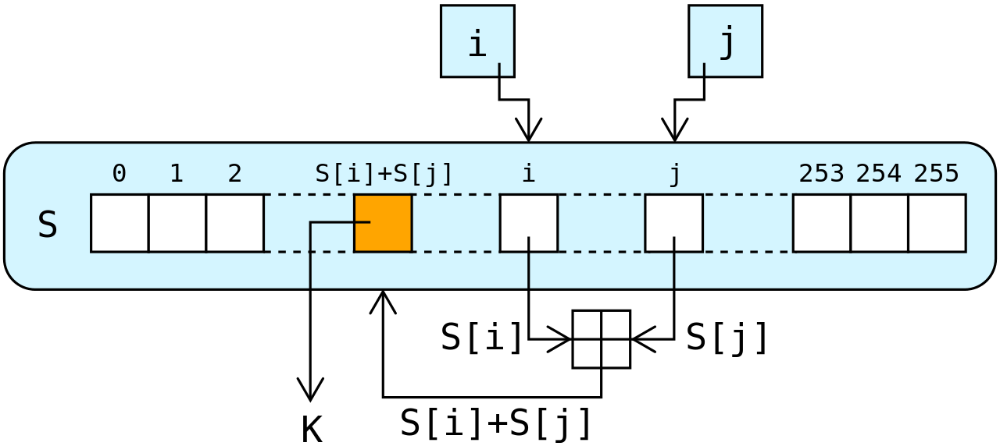
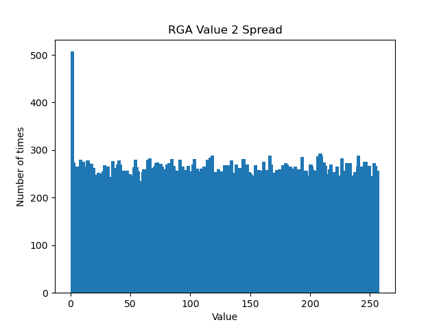

# THE RC4 CIPHER
Stuyvesant Cybersecurity 2022: Final Project

Deven Maheshwari & Jerry Liang

---

### What is RC4?

The RC4 cipher, short for the Rivest Cipher 4, is a stream cipher first developed by Ron Rivest in 1987 for the RSA Security Company. This cipher was kept a secret until 1994, when the code was leaked. The RC4 cipher is known for its simplicity and speed, and despite numerous vulnerabilities, it is remarkably secure for a cipher of its time.

Today, we will give background on what it is used for, explain how the RC4 cipher works, demonstrate an RC4 encoder/decoder, and showcase one of its vulnerabilities.

---
### Who uses it?
The RC4 cipher has been used in a wide variety of protocols. In particular, the RC4 cipher has been used in the past for Secure Socket Layer (SSL)/ Transport Layer Security (TLS), the IEEE wireless LAN standard, and the Wi-Fi Security Protocol WEP (Wireless Equivalent Protocol).

SSL and TLS are protocols that provide communication security over networks. If you remember our work with Nmap, Nmap uses these protocols to scan networks. Similarly, WEP encrypts wireless traffic.

Furthermore, there have been numerous ciphers that have been derived from RC4:

* **Spritz:** Creates hash functions and deterministic random number generators.
* **RC4A:** Variant claimed to be faster and stronger than the average RC4 cipher.
* **VMPC (Variably Modified Permutation Composition):** Variant of RC4
* **RC4A+:** More complex and stronger version of RCA and RC4A.

---
### How does it work?
The RC4 cipher comprises of two main algorithms - the **Key-Scheduling Algorithm (KSA)** and the **PRGA (Pseudo-Random Generation Algorithm)**.

The KSA algorithm uses the key input to create a permutation of all the 256 possible bytes. The PRGA algorithm uses that key schedule to generate a keystream, one byte at a time. Finally, that keystream is XOR'd with the plaintext to output the ciphertext.

Notice that these algorithms are entirely symmetric, meaning that we can encode and decode with the same key and algorithm, just in reverse.

**Code Snippets:**
```
def KSA(key):
    """
    KSA - Key Scheduling Algorithm in order to create an array of byte values to be used in RGA for encoding.
        Arguments:
            key - string
        Algorithm:
            Initializes an array of length 256 to represent the number of bytes available for key encoding then
            switches values within the array using the key length and key length in bytes.
        Return:
            S - byte array
    """

    S = [i for i in range(256)]
    key_array = bytearray(key, 'utf-8')
    j = 0
    for i in range(256):
        j = (j + S[i] + key_array[i % len(key_array)]) % 256
        temp = S[i]
        S[i] = S[j]
        S[j] = temp
    return S
```

```
def RGA(iterate, arr):
    """
    RGA - Random Generation Algorithm in order to generate a byte array to be XOR'ed with the plaintext
        Dependencies:
            KSA(key) to get the permutation array of byte encoding of the key
        Arguments:
            iterate - number of values to be generated in the byte array
            arr - the identity permutation from the KSA
        Algorithm:
            For iterates number of times, adds S[i] to j and swaps S[i] with S[j] and uses a separate value
            from S from the keystream.
        Return:
            answer - byte array to be XOR'ed
    """

    i = 0
    j = 0
    index = 0
    answer = []
    while index < iterate:
        i = (i + 1) % 256
        j = (j + arr[i]) % 256
        temp = arr[i]
        arr[i] = arr[j]
        arr[j] = temp
        k = arr[(arr[i] + arr[j]) % 256]
        answer.append(k)
        index += 1
    return answer
```


---
### Drawbacks of RC4

The largest vulnerability of RC4 is its random generating algorithm. This is one of the necessary features of the overall cipher since it creates the sequence of bytes that will be XOR'd with the plaintext and ciphertext to produce each other.

The issue here was the uneven distribution of values within this array. In 2001, it was published by Itsik Mantin and Adi Shamir that the first couple values of the RGA array are not as random as was advertised. As seen in the following graph, the value 0 comes up about double as many times as any other value for the second output value of the array. Well, it actually does come up double the amount of times as the other values. Specifically, each bit should have a 1/256 chance of being placed, yet 0 in the second index has a 1/128 probability.

This exploit was used in an attack on WEP (wireless equivalent privacy) wireless networks. Fun fact, it was later replaced by WPA (Wi-Fi protected access).



The fix for this exploit is to disregard the first values of the keystream.

There are also numerous other vulnerabilities to RC4 ciphers, including:

* **Roos’ Biases:** Correlations between keystreams and the key.
* **Biased Outputs:** Like the one we explored above.
* **Fluhrer Mantin Shamir Attack:** Exploits the nonrandomness of the first few bytes of RC4 cipher.
* **Andreas Klein Attack:** Also exploits nonrandomness of the first few bytes.
* **Royal Holloway Attack:** Used to breach and attack TLS/SSL as well as and WPA/TKIP.
* **Bar-Mitzvah Attack:** Used to attack SSL protocols.
* **Man-in-the-Middle Attacks:** Since RC4 does not provide authentication.
* **And much more.**

---
### Why does this matter to us?
The RC4 cipher was a once widely used cipher that was renowned for its speed and simplicity. However, since its invention in 1987, there have been numerous vulnerabilities that have been discovered, making RC4 no longer recommended for encryption.

Despite these vulnerabilities, RC4 is still used in some programs/protocols, opening the doors to attacks. In particular, SSH1, SSH2, WPA, and WPA2 protocols still provide the option to use RC4 (though the standard for these protocols have become AES).

The RC4 cipher exemplifies one of the most elegant ciphers developed, one that was once widely used/considered secure. It had (and still has) a great impact on modern encryption and cybersecurity.

---
